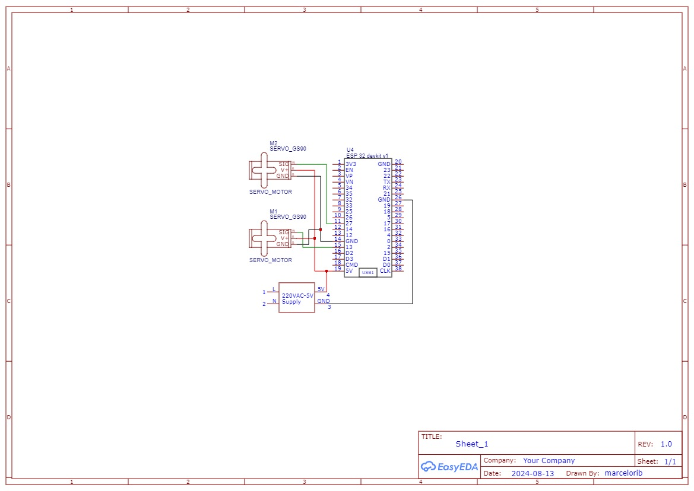

# Projeto Sistemas Embarcados IFPB

Este documento descreve as funções implementadas para a comunicação com um servo Motor utilizando o ESP32-IDF com o intuito de controlar os ângulos deste servo motor.

## Requisitos

- 1x MCU, no caso escolhemos o ESP32
- 1x Servo motor, como o GS90
- Builder
  - ESP-IDF
- Bibliotecas
  - stdio.h
  - freertos/FreeRTOS.h
  - freertos/task.h
  - esp_err.h
  - esp_log.h
  - driver/ledc.h
  - esp_system.h
  - esp_random.h
 
## Portas utilizadas na ESP32 pelo MPU6050
- PWM - GPIO PIN 13

# Funções Implementadas

## Arquivo servo_tools

### `esp_err_t servo_init(ServoConfig *config):`

**Descrição**:  
Inicializa o servomotor com base na configuração fornecida e verifica se o servo está respondendo corretamente.

**Parâmetros**:  
- `config` - Passa a struct que possui as configurações do servo.

**Retorno**:  
- `ESP_OK` - Se a inicialização for bem-sucedida.
- `ESP_FAIL` - Se a inicialização do servo falhar.
- `ESP_ERR_INVALID_ARG` - Se a configuração for feita incorretamente.

**Por que é feito**:  
A função é crucial para garantir que o servo esteja pronto para comunicação e que o ESP32 possa ler e transmitir corretamente os dados para o mesmo.

### `esp_err_t servo_set_angle(ServoConfig *config, int angle)`

**Descrição**:  
Define o ângulo do servomotor, movendo o braço acoplado ao rotor para a angulação desejada.

**Parâmetros**:  
- `config` - Ponteiro para a estrutura de configuração.
- `angle` - Angulação desejada para o braço.

**Retorno**:  
- `ESP_OK` - Se a operação for bem-sucedida.
- `ESP_FAIL` - Se ocorrer algum erro durante a operação.

**Por que é feito**:  
Esta é a função de atuação principal do projeto, onde o usuário escolhe a angulação do braço rotor.

### `esp_err_t servo_get_angle(const ServoConfig *config, ServoAngle *angle)`

**Descrição**:  
Obtém o ângulo atual do braço do servomotor.

**Parâmetros**:  
- `config` - Ponteiro para a estrutura de configuração.
- `angle` - Angulação desejada para o braço.

**Retorno**:  
- `ESP_OK` - Se a leitura for bem-sucedida.
- `ESP_FAIL` - Se ocorrer algum erro durante a leitura.

**Por que é feito**:  
Esta função obtém a angulação do braço.

## Arquivo servo_hw

### `esp_err_t hw_servo_init(uint8_t gpio_num)`

**Descrição**:

Prepara o pino GPIO para gerar sinais PWM, que são necessários para controlar o servo.

**Retorno**:
-  `esp_err_t` - Indica se a operação foi bem-sucedida ou ocorreu um erro.

**Parâmetros**:
- `uint8_t` - Um número inteiro sem sinal de 8 bits.
- `gpio_num` - Indica o número do pino do GPIO.
  
**Por que é feito**:

Prepara o pino GPIO e garante que ele esteja pronto para gerar sinais PWM corretamente.

### `esp_err_t hw_servo_set_pulse_width(uint8_t gpio_num, uint32_t pulse_width_us)`

**Descrição**:

Ajusta a largura do pulso PWM, controlando a posição do servo motor.

**Retorno**:
- `esp_err_t` - Para indicar sucesso ou falha na operação.

**Parâmetros**
- `uint8_t` - Um número inteiro sem sinal de 8 bits.
- `uint32_t` - Um número inteiro sem sinal de 32 bits.
- `gpio_num` - Indica o número do pino do GPIO.
- `pulse_width_us` - Define a largura do pulso PWM em microsegundos.

**Por que é feito**:

Controlar a largura do pulso é essencial para determinar a posição precisa do servomotor. Sem essa função, seria impossível mover o servo para o ângulo desejado.

### `esp_err_t hw_servo_deinit(uint8_t gpio_num)`

**Descrição**:

Desativa o sinal PWM e libera os recursos associados, "limpando" as configurações anteriores.

**Retorno**:
- `esp_err_t` - Assim como as outras funções, indica o sucesso ou falha da operação.

**Parâmetros**
- `uint8_t` - Um número inteiro sem sinal de 8 bits.
- `gpio_num` - Indica o número do pino do GPIO. 

**Por que é feito**:

Esta função é importante para liberar recursos do sistema e garantir que o pino GPIO não continue gerando sinais ou consumindo energia desnecessariamente após o servo não ser mais necessário.

## Esquemático

## Máquina de estados

## Diagrama de blocos 

## Protótipo

[Veja o projeto no Wokwi!](https://wokwi.com/projects/407681050838358017)

## Autores

- [Antonio Roberto](https://github.com/antoniojunior2222)
- [Aryelson Gonçalves](https://github.com/aryelson1)
- [Clarissa Lucena](https://github.com/Clarissa-de-Lucena)
- [Felipe Braz](https://github.com/felipebrazfb333) 
- [Guilherme Santos](https://github.com/GuilhermexL)
- [Marcelo Ribeiro](https://github.com/Marcelo-RSilva)

